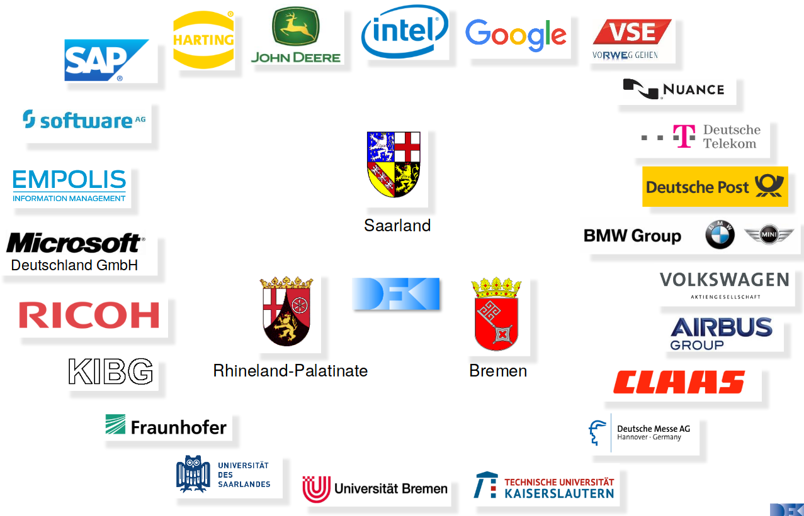
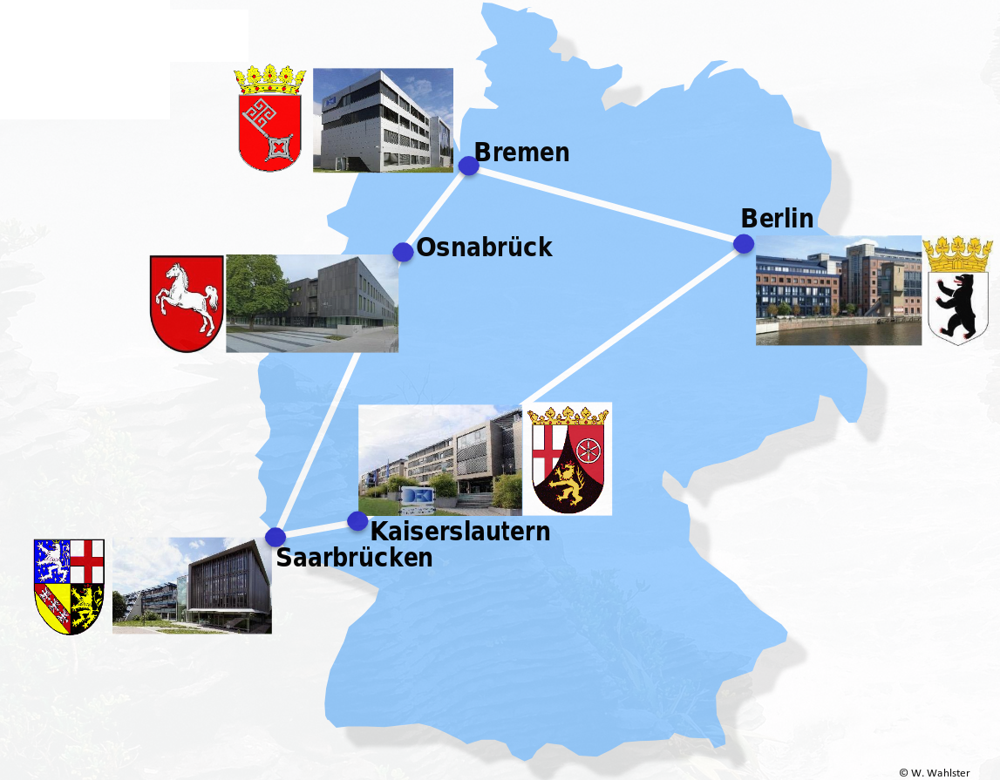
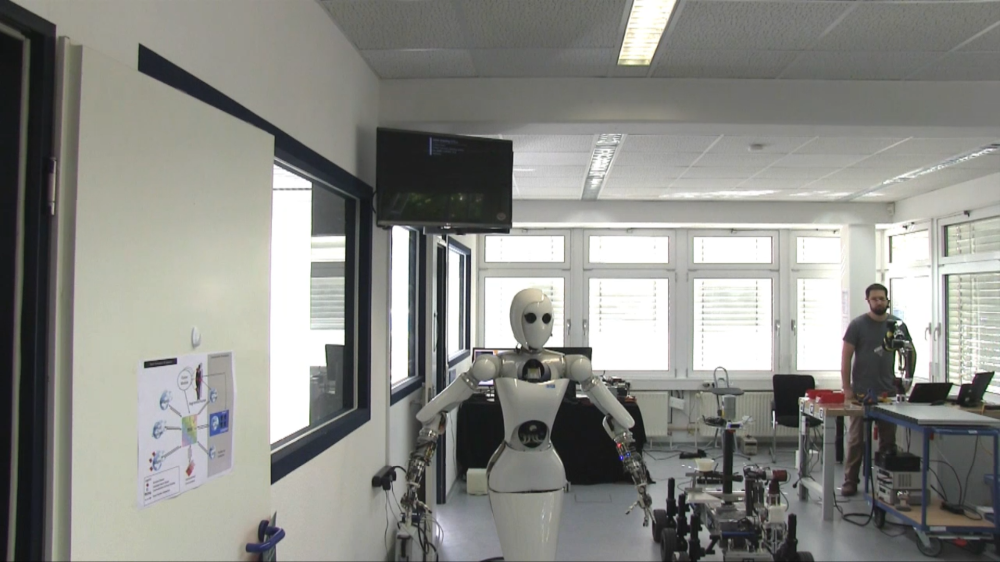

## Intro

+ Einführung in einfache Robotik mit humanoiden Roboter Pepper
+ Grundlegende Algorithmen der künstlichen Intelligenz KI und
+ Computer Vision CV werden diskutiert
+ Den Studenten wird alles zum tüfteln bereitgestellt

## Living Labs @ DFKI

## Das DFKI ist ein Joint Venture mit

## Das Pentagon der Innovation

## Video

## Geplantes Verhalten

+ Tic Tac Toe gegen Pepper am Whiteboard spielen
+ Sprachlich wird Startbefehl gegeben
+ Pepper fordert Spieler auf seine Spielzüge zu spielen
	+ Spieler muss für Pepper spielen
+ Erkennen und rückmelden von falschen und unerlaubten Spielzügen
+ Verkünden von Gewinner

## Problembeschreibung und Leistungsmass

+ Umgebung erkennen
	+ Spielfeld, Magnete, Mitspieler

+ Aktuatoren
	+ Lautsprecher zu kommunizieren
	+ Arme zum nächsten Spielzug anzeigen
	+ Display zur besseren Verständigung

+ Sensoren
	+ Mikrofon für Spielstart und -abbruch
	+ Kamera für Fotos der Umgebung und Spielfeldanalyse

+ Leistungsmass
	+ Anzahl korrekt beendeter Spiele messen
	+ Peppers Ziel ist es möglichst viele Spiele zu gewinnen und möglichst wenige zu verlieren

## Lösungsansatz - Agententypen

+ Grundstruktur: Model-based Agent
	+ Ausgelegt für befolgen eines festen Ablauf
		+ mit Ziel: Spiel erfolgreich beenden

## Ansatz für Spracheingabe für Spielstart / -abbruch

+ Für Spielstart und -abbruch: Simple Reflex Agent
	+ Wertet Spracheingaben aus und startet ein Spiel
		+ wenn die richtigen Worte gefallen sind

## Ansatz für die Spiellogik

+ Spiellogik: Utility-based Agent
	+ Input: momentanes Spielfeld
		+ daraus werden alle möglichen Spielzüge ermittelt
		+ mithilfe einer Heuristik (dazu später mehr) berechnet wie jeder Spielzug für
			Pepper ist
		+ aus allen Berechnungen wird dann die beste ausgeführt

### Heuristik
Eine Art Vermutung, die auf der Grundlage bestimmter Annahmen getroffen werden.
Damit können keine perfekten Ergebnisse garantiert werden aber ist schnell berechnet.

## Utility-based Agent

{ height=40% }

## Was macht was und was ist wofür zuständig

+ `Main.py`
	+ Ist das Startup File für das Hauptprogramm
	+ Damit werden alle Komponenten gestartet
+ `DetectBoard.py`
	+ Ist die Datei die den Hauptsächlichen Bildverarbeitungscode beinhaltet
		+ Im Ordner image_processing befinden sich zudem noch 3 weitere Hilfsdateien mit Hilfsfunktionen die von `DetectBoard.py` aufgerufen werden
+ `TicTacToe.py`
	+ Darin wird die gesamte Spiellogik abgewickelt
	+ `TicTacToeAiHeuristic.py`
		+ Darin befindet sich die Spiellogik bestehend aus klar vordefinierten Bedingungsregeln
		+ Als Alternative zeigt `TicTacToeAiRand.py` eine rein zufällige Spielstrategie

## Wie weiter?

1) Ideen diskutieren
2) Interessen herausfinden
3) Gruppen bilden
4) Tüfteln
5) ???
6) Feedback

## Ideen woran getüftelt werden kann

+ Mach Pepper unbesiegbar

+ Die Bildverarbeitung verstehen und experimentieren

+ Andere/Mehr Behaviors und Animationen

+ Eigene Idee(n) einbringen :)

## Eingesetzte externe Software

	Ubuntu Linux 18.04
		+ Python 2.7
		+ OpenCV 3.4
		+ NaoQi 2.5
		+ Entwicklungsumgebung PyCharm 2019.2

$\to$ Bereitgestellte VM hat alles nötige

## Workflow

Demo :)
